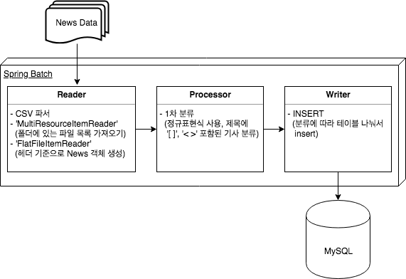

series-articles-clustering
==================
뉴스 연재기사 클러스터링 시스템 프로젝트

News-Batch
--------------
데이터 수신 및 1차 분류

### 1. 프로젝트 개요
#### 1.1 사용 기술
---
* Java
* Spring Batch
* MySQL
* mybatis

#### 1.2 사용 이유
---
###### Spring Batch
* 대용량 처리에 대한 프레임워크 이기 때문에 적합하다고 생각했습니다.
* 데이터를 파싱하고, 1차 분류 (뉴스 기사 제목 내의 '[ ]', '< >' 유무 판단) 작업을 처리 시, Step 단계에 따라 읽기, 정제하기, 쓰기 등의 작업으로 나뉘어져 있어 코드 상으로도 순차적인 처리가 가능하여 코드 파악이 용이하다고 생각했습니다.

###### MySQL
* 해당 데이터베이스에 대한 쿼리에 익숙합니다.
* 쿼리 튜닝과 인덱스, 테이블 구조를 통한 최적화에 익숙하여 선택하였습니다.
* 단순히 읽고 쓰는 용도가 아닌 정제를 위한 작업이 수반되어 데이터를 파악하는데 관계형 데이터베이스가 더 적합하다고 생각했습니다.

#### 1.3 배치 설계
---

### 2. 프로젝트 사용법
#### 2.1 프로젝트 구조
---
>News-Batch (프로젝트 폴더)
>>-batch-mysql (배치 메타테이블 스키마, mysql)

>>-data (년/ 월/ 날짜별 파일 목록)

>>-src (소스코드)

>>-pom.xml (maven)

>>-out ('.jar', 실행파일)

>>...

#### 2.2 실행
---
1. DB 세팅
2. 데이터 경로 확인 'data' 폴더 구조 확인
3. 프로젝트 '.jar' 파일 생성 (실행 파일)

##### 2.2.1 DB 세팅
* 'batch-mysql' 파일 다운로드 후 MySQL 에 배치 메타 테이블에 대한 스키마 생성

##### 2.2.2 데이터 경로 확인 'data' 폴더 구조 확인
* 배치 실행 시 년, 월 기준으로 디렉토리 구조 파라미터로 입력 받아 파일 실행.

##### 2.2.3 프로젝트 '.jar' 파일 생성 (실행 파일)
<strong><em>'IntelliJ'</em></strong> 기준으로 작성하였습니다.
___

     1. File > Project Structure > Artifact > '+' 기호 클릭 > 'Main Class' 선택 후 'MANIFEST' 파일 생성 경로를 'src > main > resource' 경로로 설정
     
	 2. Build > Build Artifact > Build
	 
	 3. 프로젝트 디렉토리에 'out' 폴더 생성 확인
	 
	 4.'out' 폴더 내부에 '[project_name].jar' 파일 실행

* 실행 명령어

	  java -jar [project_name].jar year=2017 month=10
